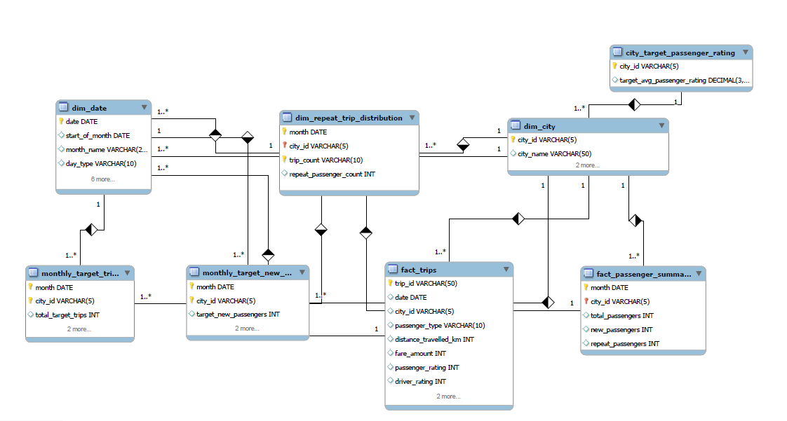
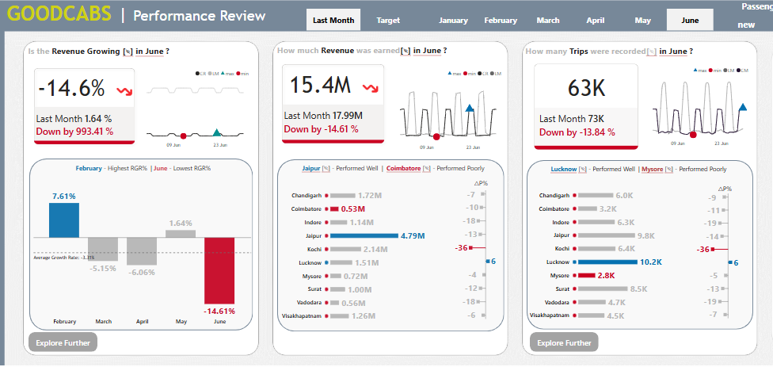
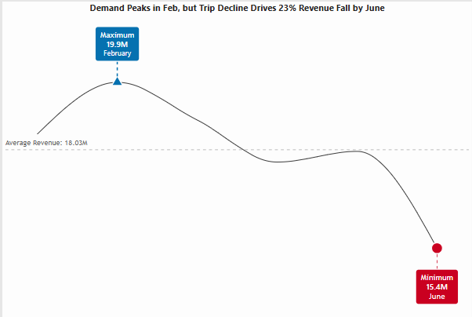

# Goodcabs Operations Analysis

## Table Content
- [Project Overview](#1-project-overview)
- [Data Structure & Initial Checks](#2-data-structure--initial-checks)
- [Executive Summary](#3-executive-summary)
- [Insights](#4insights)
- [Recommendations](#5recommendations)
## 1. Project Overview

Goodcabs, established in 2022, has rapidly expanded its presence in tier-2 Indian cities by empowering local drivers and delivering exceptional service. Currently operating in 10 cities, the company is committed to providing top-notch transportation while fostering sustainable livelihoods. In 2024, Goodcabs aims for aggressive growth and enhanced passenger satisfaction by monitoring key metrics such as trip volume, satisfaction scores, repeat rates, trip distribution, and the proportion of new versus returning passengers.

This project provides insights and recommendations in the following key areas:  
- Year-to-Date Analysis – Tracking revenue and trip volume trends to assess seasonal and monthly performance.  
- Repeat Passenger Analysis – Understanding retention patterns and loyalty-driven revenue.  
- City Performance Analysis – Evaluating city-wise operational strengths, losses, and localized demand shifts.  
- Trip Frequency Analysis – Identifying customer engagement levels through trip frequency segmentation.  

An interactive Power BI dashboard is available for download here.[Click Here](https://app.powerbi.com/view?r=eyJrIjoiMDc0MjU2N2MtMjIzZS00ZmMxLWE3NDYtYTg0YjkxZmFlMTI3IiwidCI6ImM2ZTU0OWIzLTVmNDUtNDAzMi1hYWU5LWQ0MjQ0ZGM1YjJjNCJ9)

---

## 2. Data Structure & Initial Checks

The Goodcabs database comprises eight tables: Dim_city, Dim_date, Fact_trips, Fact_Passenger_summary,dim_repeat_trip_distribution,city_target_passenger_rating, monthly_target_new_passengers,monthly_target_trips among others, totaling approximately 425,000 rows.

Prior to analysis, comprehensive quality control checks were conducted to ensure data integrity and familiarity. The SQL queries used for these inspections are available here.

## 3. Executive Summary

### Key Findings

**Revenue Decline:** The year-to-date revenue growth rate is negative, indicating underperformance. Notably, June contributed significantly to this decline, with a reduction in trips leading to a revenue drop of ₹2.6 million. If this trend persists, the company could face a loss of ₹10 million in the next three months.

## 4.Insights

### Revenue Trend by Month

**Peak Performance:** February 2024 recorded the highest revenue at ₹19.9 million with 75,000 trips, suggesting seasonal demand peaks in most cities.  

**Subsequent Decline:** Post-February, revenue declined until May, which saw a slight recovery aligning with typical holiday seasonality.  

**June Downturn:** A significant drop occurred in June, with trips decreasing from 73,000 in May to 63,000, leading to a revenue decline from ₹18 million to ₹15.4 million.

  

---

## City Performance Analysis

### Kochi

**Revenue Loss:** Experienced a total loss of ₹1.2 million due to the onset of the monsoon season on May 30, 2024, leading to decreased demand.  

**Repeat Passenger Impact:** Weekday repeat passenger trips dropped by ₹420,000, with a 13% decline in the Repeat Passenger Rate (RPR) and an 8% reduction in the highest trip frequency (two trips).  

**New Passenger Decline:** A 31% reduction in new passengers resulted in an additional loss of ₹320,000.

### Jaipur

**Revenue Loss:** Incurred a total loss of ₹700,000 due to an increased Average Fare per Trip (AFT) despite a consistent Average Passenger Rating (APR) of 8.  

**Repeat Passenger Decline:** Weekday repeat passengers decreased by 34%, causing a ₹450,000 revenue loss.  

**Trip Frequency:** The reduction in two-trip frequencies and stagnant other frequencies indicate low conversion of new to repeat passengers.

### Lucknow

**Revenue Gain:** Achieved a total gain of ₹80,000, driven by extreme heat (44.7°C) in June, prompting increased service usage, especially on weekends.  

**Weekend Growth:** Weekend revenue increased by 13%, with weekday revenue up by 3%.  

**Passenger Trends:** Weekend repeat passenger trips rose by 13%, and new passengers grew by 14%. However, a decline in RPR due to lower satisfaction ratings (5.9) and a drop in the highest trip frequency (from six to three trips) highlight the need for improved retention strategies.

---

## 5.Recommendations

### Kochi

- **Monsoon Strategies:** Implement monsoon discounts, first-ride offers, and corporate plans for quick recovery.  
- **Loyalty Programs:** Focus on loyalty initiatives, optimized pricing, and ride allocation to sustain demand.  
- **Service Expansion:** Introduce a fleet of two-wheelers to capture the delivery demand of quick commerce.

### Jaipur

- **Passenger Incentives:** Launch weekday ride passes, reactivation campaigns, and multi-trip discounts to boost repeat passengers.  
- **Dynamic Pricing:** Implement variable APR, lower prices during low demand, first-ride discounts, and referral programs to improve pricing and passenger conversion.  
- **Personalized Offers:** Develop loyalty rewards, personalized promotions, and AI-driven demand forecasting for sustained growth.

### Lucknow

- **Enhance Experience:** Improve repeat passenger experience by addressing service quality issues and offering exclusive weekend loyalty perks.  
- **Weekend Optimization:** Leverage higher weekend demand by optimizing pricing and marketing, and enhancing trip frequency with exclusive weekend ride bundles.  
- **Advanced Strategies:** Introduce AI-driven demand forecasting, heat-adaptive pricing, and improved customer service strategies to sustain long-term growth.
